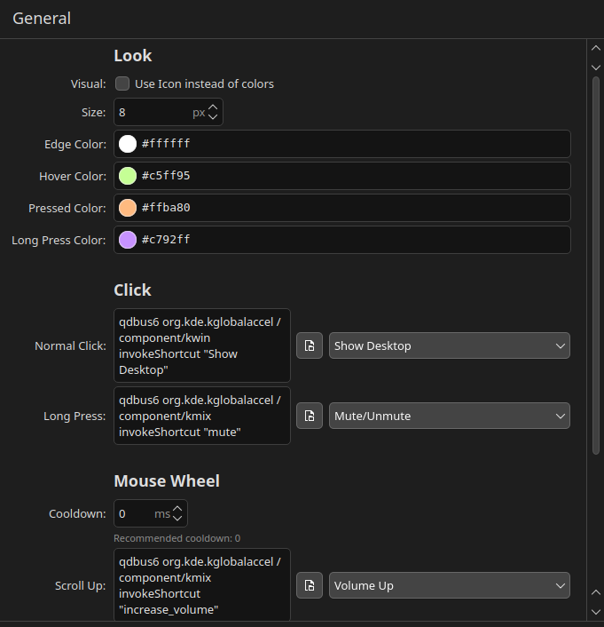

<div align="center">
  <h1>🧬 Power Show Desktop | Plasma</h1>
  <p><strong>Show desktop and shortcut central.</strong></p>
  <p>
    <strong>Powered By: O Maior de Minas</strong> <a href="https://www.cruzeiro.com.br/">www.cruzeiro.com.br</a>  🦊💙
  </p>
  
</div>

---

**Power Show Desktop | Plasma** is an enhanced widget (plasmoid) for KDE Plasma. In addition to offering the classic behavior of "peeking" or minimizing windows to see your desktop (Windows 7 style), this version has been heavily modified to serve as an **invisible shortcut central**.

With it, you can assign powerful scripts and commands to clicks and mouse scroll movements, all in a single button at the corner of your screen!

## ✨ New in this Version (v1.4)

This version has been redesigned with productivity in mind, introducing new configuration screens and dozens of new triggers:

*   **Advanced Click Actions:** Configure independent scripts or commands for:
    *   `Ctrl + Click`
    *   `Alt + Click`
    *   `Shift + Click`
    *   `Middle Click`
*   **Long Press:** Hold the left mouse button pressed to execute a secondary action.
    *   *Custom Glow Color:* Choose a custom glow color to indicate that the long press has been triggered.
    *   *Smart Anti-Conflict:* The widget understands when you are long-pressing and automatically blocks the "minimize windows" action, avoiding unwanted behaviors.
*   **Mouse Wheel Controls (Scroll):**
    *   Assign native `qdbus` commands to the mouse wheel.
    *   Configure `Ctrl + Scroll Up` and `Ctrl + Scroll Down` (perfect for quickly switching virtual desktops).
    *   **Configurable Cooldown:** Control scroll sensitivity! Adjust the timeout (in milliseconds) to prevent the mouse from triggering the same action dozens of times in a single movement.
*   **Modern Layout:** The internal settings panel of the widget has been updated to use KDE's native Kirigami design, now featuring smart command presets and a file picker for bash scripts.

---

## 🚀 Installation

The easiest way to install is by using the packaged `.plasmoid` file available in the **Releases** tab.

1. Go to the project's [Releases](../../releases) page.
2. Download the latest `Power-Show-Desktop-1.4.plasmoid` file.
3. To install, you can double-click the downloaded file and use the KDE installer, or use the terminal:
   ```bash
   kpackagetool6 -i Power-Show-Desktop-1.4.plasmoid
   ```
4. Restart your plasma panel (`systemctl restart --user plasma-plasmashell`) and add the "Power Show Desktop | Plasma" widget to your panel.

---

## 🛠️ How to Configure

After adding the widget to your taskbar:
1. Right-click on it and select **"Configure 🧬 Power Show Desktop | Plasma"**.
2. In the **General** tab, you can choose the click color, the standard command, and the new **Long Press Command and Color**.



3. In the **Advanced Actions** tab, you have access to advanced fields for modifiers (`Ctrl`, `Shift`, `Alt`, `Middle Click`) and exclusive **Mouse Scroll** commands.


### Useful Example for Scrolling (Switching Desktops)
Try selecting these commands from the smart Presets dropdown in the **Advanced Actions** tab to switch desktops using `Ctrl + Scroll`:
- **Ctrl+Scroll Up:** `Switch One Desktop to the Right`
- **Ctrl+Scroll Down:** `Switch One Desktop to the Left`

---

## 📝 License
This software is open-source and distributed under the **GPL-3.0** license.  
*(This project is a fork of the acclaimed original `plasma-applet-win7showdesktop` created by Zren, modified and modernized by Leonardo Pimenta).*
